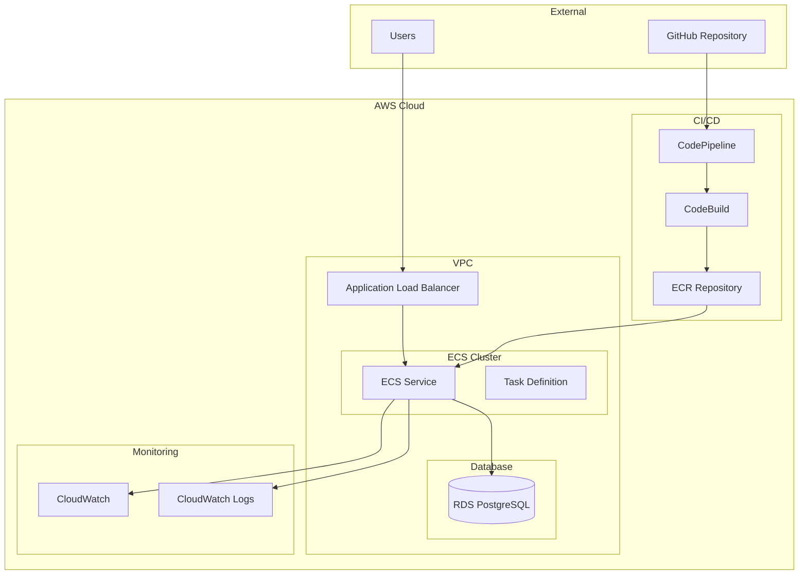
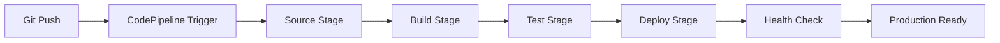

# 🚀 Projeto BIA - Bootcamp de Inteligência Artificial na AWS

> **Imersão AWS & IA** | 28/07 a 03/08/2025 | Online e ao Vivo às 20h  
> **Instrutor:** Henrylle Maia  
> [📝 Página de Inscrição do Evento](https://org.imersaoaws.com.br/github/readme)

---

## 📋 Índice

- [🎯 Sobre o Projeto](#-sobre-o-projeto)
- [🏗️ Arquitetura e Tecnologias](#️-arquitetura-e-tecnologias)
- [📊 Análise Técnica do Projeto](#-análise-técnica-do-projeto)
- [💰 Análise de Custos](#-análise-de-custos)
- [🚀 Como Executar](#-como-executar)
- [🔧 Desenvolvimento](#-desenvolvimento)
- [📚 Aprendizado Contínuo](#-aprendizado-contínuo)
- [🛠️ DevOps e CI/CD](#️-devops-e-cicd)
- [📖 Documentação](#-documentação)
- [🤝 Contribuição](#-contribuição)

---

## 🎯 Sobre o Projeto

O **BIA** (Bootcamp de Inteligência Artificial) é uma aplicação full-stack desenvolvida durante a Imersão AWS & IA, projetada para demonstrar conceitos fundamentais de:

- **Cloud Computing** com AWS
- **Containerização** com Docker
- **Orquestração** com ECS
- **CI/CD** com CodePipeline e CodeBuild
- **Infraestrutura como Código** com Terraform
- **Monitoramento** e observabilidade
- **Otimização de custos** na nuvem

### 🎓 Filosofia Educacional

Este projeto segue uma abordagem **"simplicidade primeiro"**, priorizando:
- ✅ **Clareza conceitual** sobre complexidade técnica
- ✅ **Aprendizado progressivo** com evolução gradual da arquitetura
- ✅ **Práticas reais** aplicáveis no mercado de trabalho
- ✅ **Documentação educativa** para facilitar o entendimento

---

## 🏗️ Arquitetura e Tecnologias

### 🔧 Stack Tecnológico

#### **Frontend**
- **React 18.3.1** - Interface de usuário moderna
- **Vite 5.4.19** - Build tool otimizado
- **React Router 6.28.0** - Roteamento SPA
- **React Icons 5.3.0** - Biblioteca de ícones

#### **Backend**
- **Node.js** - Runtime JavaScript
- **Express 4.17.1** - Framework web minimalista
- **Sequelize 6.6.5** - ORM para PostgreSQL
- **PostgreSQL** - Banco de dados relacional

#### **AWS Services**
- **ECS (Elastic Container Service)** - Orquestração de containers
- **EC2** - Instâncias de computação (t3.micro)
- **RDS PostgreSQL** - Banco de dados gerenciado
- **ECR** - Registry de containers
- **CodePipeline + CodeBuild** - CI/CD
- **CloudWatch** - Monitoramento e logs
- **Application Load Balancer** - Balanceamento de carga

#### **DevOps & IaC**
- **Docker** - Containerização
- **Terraform** - Infraestrutura como código
- **GitHub** - Controle de versão e source
- **Amazon Q** - Assistente de IA para desenvolvimento

### 🏛️ Arquitetura da Aplicação



---

## 📊 Análise Técnica do Projeto

### 🔍 Estrutura do Projeto

```
bia/
├── 📁 api/                    # Backend API (Node.js + Express)
│   ├── controllers/           # Controladores da aplicação
│   ├── models/               # Modelos Sequelize
│   ├── routes/               # Definição de rotas
│   └── data/                 # Dados estáticos
├── 📁 client/                # Frontend (React + Vite)
│   ├── src/                  # Código fonte React
│   ├── public/               # Assets estáticos
│   └── package.json          # Dependências frontend
├── 📁 IaaC/                  # Infrastructure as Code
│   └── Terraform/            # Templates Terraform
├── 📁 database/              # Configurações de banco
│   └── migrations/           # Migrações Sequelize
├── 📁 scripts/               # Scripts de automação
├── 📁 analise-custos/        # Análise e otimização de custos
├── 📁 docs/                  # Documentação técnica
├── 📁 .amazonq/              # Configurações Amazon Q
├── 🐳 Dockerfile             # Container da aplicação
├── 📋 buildspec.yml          # Configuração CodeBuild
├── 🐳 compose.yml            # Docker Compose para desenvolvimento
└── 📦 package.json           # Dependências do projeto
```

### 🎯 Características Técnicas

#### **Performance**
- **Single Page Application** com React para UX fluida
- **Build otimizado** com Vite para desenvolvimento rápido
- **Container otimizado** com imagem Node.js slim
- **Caching** de dependências npm no pipeline

#### **Escalabilidade**
- **Arquitetura de microserviços** preparada para crescimento
- **ECS Service** com auto-scaling configurável
- **Load Balancer** para distribuição de tráfego
- **Database connection pooling** com Sequelize

#### **Segurança**
- **Security Groups** com princípio de menor privilégio
- **VPC** isolada para recursos AWS
- **Secrets Manager** preparado para credenciais
- **HTTPS** ready com ALB

#### **Observabilidade**
- **CloudWatch Logs** centralizados
- **Health checks** em múltiplas camadas
- **Métricas** de aplicação e infraestrutura
- **Alertas** configuráveis por ambiente

---

## 💰 Análise de Custos

### 📊 Resumo Financeiro

| **Métrica** | **Valor** |
|-------------|-----------|
| **Custo Atual** | $22.74/mês |
| **Economia Potencial** | $4.15 - $14.95/mês |
| **Redução Possível** | 18.2% - 65.7% |

### 💡 Otimizações Implementadas

#### **🚀 Implementação Rápida**
```bash
# Executar otimizações automáticas
cd analise-custos
./implementacao-rapida.sh
```

#### **📈 Principais Otimizações**

1. **Spot Instances** - Economia de 50-70% em EC2
2. **Reserved Instances** - Economia de 30-40% para workloads estáveis  
3. **Storage GP3** - Melhor custo-benefício que GP2
4. **Log Retention** - Configuração inteligente de retenção
5. **ECR Lifecycle** - Limpeza automática de imagens antigas

### 📚 Documentação de Custos

- [**📊 Análise Detalhada de Custos**](./analise-custos/docs/analise-detalhada-custos.md)
- [**📋 Resumo das Otimizações**](./analise-custos/docs/resumo-otimizacoes.md)
- [**🌐 Relatório de Rede ECS-RDS**](./analise-custos/docs/relatorio-rede-ecs-rds.md)

---

## 🚀 Como Executar

### 🐳 Desenvolvimento Local (Docker Compose)

```bash
# 1. Clonar o repositório
git clone https://github.com/henrylle/bia.git
cd bia

# 2. Executar com Docker Compose
docker compose up -d

# 3. Executar migrações do banco
docker compose exec server bash -c 'npx sequelize db:migrate'

# 4. Acessar a aplicação
# Frontend: http://localhost:3000
# Backend: http://localhost:8080
# Health Check: http://localhost:8080/api/versao
```

### 🖥️ Desenvolvimento Local (Nativo)

#### **Backend**
```bash
# Instalar dependências
npm install

# Configurar banco de dados
npm run start_db

# Executar migrações
npx sequelize db:migrate

# Iniciar servidor
npm start
```

#### **Frontend**
```bash
# Navegar para o diretório client
cd client

# Instalar dependências
npm install

# Iniciar em modo desenvolvimento
npm run dev
```

### ☁️ Deploy na AWS

```bash
# 1. Build e push da imagem
./scripts/build-and-push.sh

# 2. Deploy no ECS
./deploy-ecs.sh

# 3. Verificar saúde da aplicação
curl https://seu-alb-url.com/api/versao
```

---

## 🔧 Desenvolvimento

### 🧪 Testes

```bash
# Executar testes unitários
npm test

# Executar testes com coverage
npm run test:coverage

# Testes de integração
npm run test:integration
```

### 🔍 Qualidade de Código

```bash
# Linting
npm run lint

# Formatação
npm run format

# Análise de segurança
npm audit

# Análise de vulnerabilidades com Checkov
checkov -f Dockerfile
```

### 🐛 Debug e Troubleshooting

```bash
# Logs da aplicação
docker compose logs -f server

# Logs do banco de dados
docker compose logs -f db

# Verificar conectividade
./check-disponibilidade.sh

# Testar latência
./testar-latencia.sh
```

---

## 📚 Aprendizado Contínuo

### 🎯 Objetivos de Aprendizado

#### **Módulo 1: Fundamentos**
- [x] Containerização com Docker
- [x] Orquestração com ECS
- [x] Banco de dados RDS
- [x] Networking básico na AWS

#### **Módulo 2: CI/CD**
- [x] Pipeline com CodePipeline
- [x] Build automatizado com CodeBuild
- [x] Registry de containers com ECR
- [x] Deploy automatizado

#### **Módulo 3: Infraestrutura**
- [x] Infrastructure as Code com Terraform
- [x] Security Groups e VPC
- [x] Load Balancing com ALB
- [x] Monitoramento com CloudWatch

#### **Módulo 4: Otimização**
- [x] Análise de custos
- [x] Performance tuning
- [x] Segurança avançada
- [x] Observabilidade

### 📖 Recursos de Estudo

#### **Documentação Oficial**
- [AWS ECS Documentation](https://docs.aws.amazon.com/ecs/)
- [Terraform AWS Provider](https://registry.terraform.io/providers/hashicorp/aws/latest/docs)
- [React Documentation](https://react.dev/)
- [Node.js Best Practices](https://nodejs.org/en/docs/guides/)

#### **Cursos Recomendados**
- AWS Certified Solutions Architect
- Docker Certified Associate
- Terraform Associate Certification
- React Developer Certification

#### **Livros Sugeridos**
- "Designing Data-Intensive Applications" - Martin Kleppmann
- "Building Microservices" - Sam Newman
- "The DevOps Handbook" - Gene Kim
- "Clean Architecture" - Robert C. Martin

### 🏆 Próximos Desafios

1. **Implementar autenticação** com Cognito
2. **Adicionar cache** com ElastiCache
3. **Implementar observabilidade** com X-Ray
4. **Criar testes E2E** com Cypress
5. **Implementar feature flags** com AppConfig

---

## 🛠️ DevOps e CI/CD

### 🔄 Pipeline de Deploy



### 📋 Buildspec Configuration

O pipeline utiliza o arquivo `buildspec.yml` para:
- **Build** da aplicação Node.js
- **Build** da imagem Docker
- **Push** para ECR
- **Deploy** no ECS
- **Testes** automatizados

### 🔐 Segurança no Pipeline

- **IAM Roles** com permissões mínimas
- **Secrets** gerenciados pelo Secrets Manager
- **Vulnerability scanning** com Checkov
- **Code quality** gates

---

## 📖 Documentação

### 📁 Estrutura da Documentação

- **[📋 Scripts](./scripts/README.md)** - Automações e utilitários
- **[🏗️ API](./api/README.md)** - Documentação da API REST
- **[⚛️ Client](./client/README.md)** - Documentação do frontend React
- **[🗄️ Database](./database/README.md)** - Schema e migrações
- **[🏛️ IaaC](./IaaC/README.md)** - Infraestrutura como código
- **[🧪 Tests](./tests/README.md)** - Estratégia de testes
- **[📊 Docs](./docs/README.md)** - Documentação técnica geral

### 🤖 Amazon Q Integration

Este projeto utiliza **Amazon Q** como assistente de IA para:
- **Code review** automatizado
- **Sugestões** de otimização
- **Documentação** automática
- **Troubleshooting** inteligente

Configurações em `.amazonq/`:
- `mcp.json` - Configuração principal
- `rules/` - Regras específicas do projeto

---

## 🤝 Contribuição

### 🔄 Workflow de Contribuição

1. **Fork** o repositório
2. **Crie** uma branch para sua feature (`git checkout -b feature/nova-funcionalidade`)
3. **Commit** suas mudanças (`git commit -am 'Adiciona nova funcionalidade'`)
4. **Push** para a branch (`git push origin feature/nova-funcionalidade`)
5. **Abra** um Pull Request

### 📝 Padrões de Commit

```
feat: adiciona nova funcionalidade
fix: corrige bug específico
docs: atualiza documentação
style: mudanças de formatação
refactor: refatoração de código
test: adiciona ou modifica testes
chore: tarefas de manutenção
```

### 🧪 Checklist de PR

- [ ] Testes passando
- [ ] Documentação atualizada
- [ ] Code review aprovado
- [ ] Build pipeline verde
- [ ] Performance não degradada

---

## 📞 Suporte e Comunidade

### 🆘 Como Obter Ajuda

1. **Issues** - Para bugs e feature requests
2. **Discussions** - Para perguntas gerais
3. **Wiki** - Para documentação colaborativa
4. **Discord** - Para chat em tempo real

### 👥 Comunidade

- **Instrutor:** [Henrylle Maia](https://github.com/henrylle)
- **Evento:** [Imersão AWS & IA](https://org.imersaoaws.com.br)
- **Período:** 28/07 a 03/08/2025

---

## 📄 Licença

Este projeto está licenciado sob a **ISC License** - veja o arquivo [LICENSE](LICENSE) para detalhes.

---

## 🙏 Agradecimentos

- **Henrylle Maia** - Instrutor e mentor
- **Comunidade AWS** - Suporte e recursos
- **Participantes do Bootcamp** - Colaboração e feedback
- **Amazon Q** - Assistência de IA no desenvolvimento

---

<div align="center">

**🚀 Desenvolvido com ❤️ durante a Imersão AWS & IA**

[](https://aws.amazon.com/)
[](https://docker.com/)
[](https://reactjs.org/)
[](https://nodejs.org/)
[](https://terraform.io/)

</div>

---

*Última atualização: 02/08/2025*  
*Análise de custos realizada em 31/07/2025 com Amazon Q*
